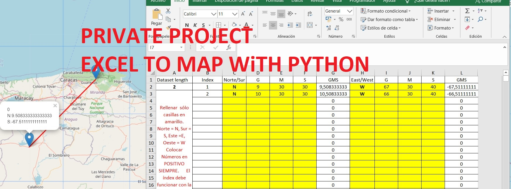

# Dibujar localizaciones, polilíneas, círculos desde coordenadas en Excel
<!-- Sección portada del repositorio -->
<a href="#">
    
</a>

Este script en python se realizó para dibujar en un mapa una serie de coordenadas suministradas desde una hoja Excel, pensando en usuarios con conocimientos básicos y/o nulos de Python. 

Descargar los archivos en una misma carpeta.

## Qué se necesita si soy usuario de Windows?

Se necesita tener instalado Python 3.9 (preferiblemente), el cual puede descargarse desde la tienda oficial de Microsoft de forma gratuita.

- [Python 3.9](https://www.microsoft.com/store/productId/9P7QFQMJRFP7)


También es necesario instalar algunas dependencias de Python la primera vez para el correcto funcionamiento del script, para esto tan sólo se debe dar doble click al archivo: `instalar dependencias.bat`. Si por el contrario, se desean instalar las dependencias de Python de forma manual, es necesario ejecutar las siguientes líneas de código en el prompt (parece repetir, pero es una forma de evitar errores si hay más de una versión de python en el pc, o más de un usuario incluso en windows):

```sh
pipenv install
```

## Cómo ejecuto el script de Python?

Para ejecutar el script, se debe ejecutar un ambiente virtual ejecutando el archivo `pipenv shell.bat` o simplemente ejecutando en prompt de Windows: 

```sh
pipenv shell
```

Después de ejecutado el ambiente virtual, se debe ingresar la siguiente línea de código en el prompt de Windows para ejecutar el script de Python:

```sh
pipenv run main.py
```

El resultado se visualizará en el archivo Mapa.html, abrir desde cualquier navegador.

<!-- Sección portada del repositorio -->
<a href="#">
    
</a>